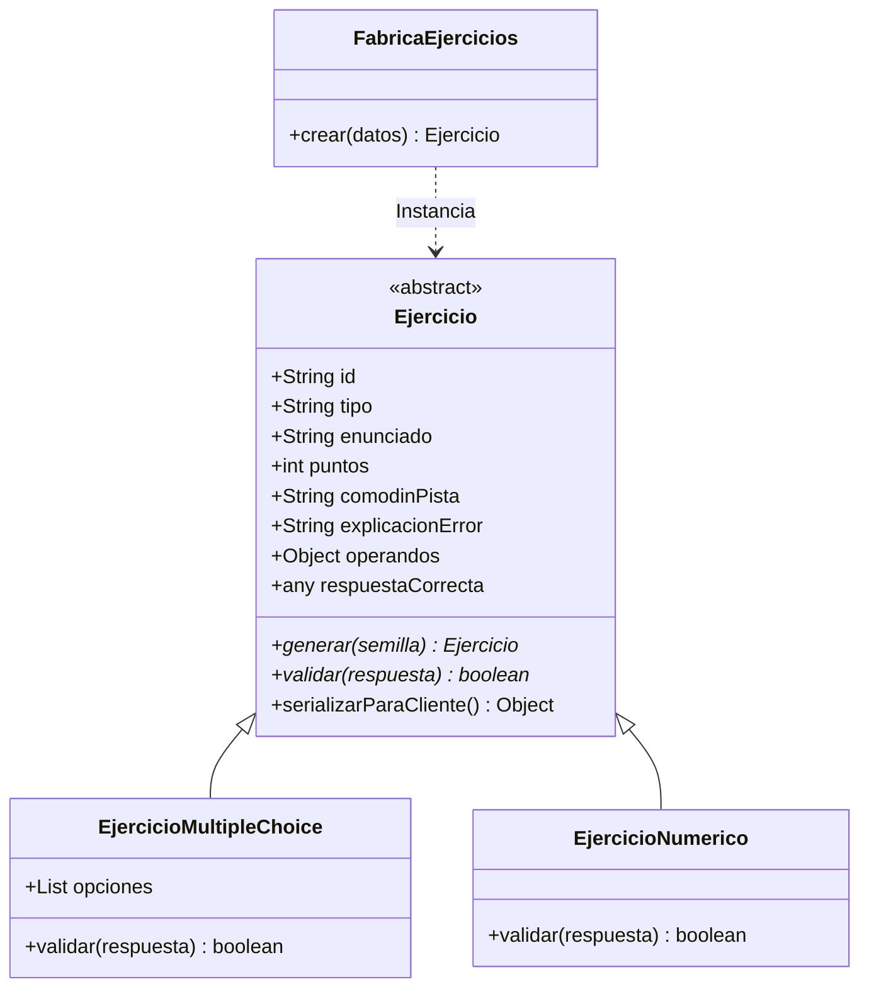

# Plan de Refactorización de Ejercicios a OOP/SOLID y Integración con Figma

Este documento detalla el plan de refactorización para migrar el sistema de ejercicios de **Mate-Mático** de una estructura procedimental a una arquitectura orientada a objetos (OOP) bajo principios SOLID, además de incorporar los requerimientos de la UI final diseñados en Figma.

---

## 1. Motivación y Justificación Técnica (El "¿Por qué?")

### El Problema Actual
La base de código actual delega la generación y validación de ejercicios en funciones procedimentales agrupadas en `registry.js` y `exercise.service.js`. Esto presenta serios problemas de mantenibilidad y escalabilidad:
1. **Acoplamiento Alto**: El validador del servicio (`exercise.service.js`) inspecciona directamente el tipo del ejercicio (`multiple_choice` o `numeric`) y bifurca la validación de forma manual. Añadir una nueva interacción (ej. verdadero/falso, ordenar fracciones, arrastrar y soltar) obliga a tocar el núcleo del validador de progreso, violando el **Principio de Abierto/Cerrado (SOLID - Open/Closed Principle)**.
2. **Duplicación de Responsabilidades**: Las comparaciones de strings sanitizados y redondeos decimales para tolerancias flotantes están dispersas. No hay un único dueño de la regla de validación de un tipo de ejercicio.
3. **Desalineación con la UI (Figma)**: Los generadores matemáticos actuales en `porcentajes.js` usan constantes con precios fijos irreales y no cubren las situaciones de la vida cotidiana diseñadas en los wireframes (ej. el cálculo del ahorro exacto en una compra o el nuevo importe de un servicio de internet tras un aumento).

### La Solución Propuesta (OOP + SOLID)
Aislamos las responsabilidades en dos capas independientes:
*   **Capa de Estructura e Interacción (SOLID - Single Responsibility)**: Clases concretas que representan *cómo* responde el usuario (`EjercicioMultipleChoice`, `EjercicioNumerico`). Estas clases heredan de una base abstracta `Ejercicio` y son las únicas responsables de validar las respuestas (`validar()`) y limpiar los datos que viajan al frontend (`serializarParaCliente()`).
*   **Capa de Contenido Matemático (Pattern Strategy)**: Mapeo de generadores dinámicos que calculan los números aleatorios a partir de la semilla, redactan el enunciado contextualizado con situaciones reales y retornan instancias configuradas de las clases anteriores.

---

## 2. Diagrama de Clases (Domain Model)



---

## 3. Plan de Cambios Detallado (El "Qué")

### 🏛️ Capa de Estructura OOP (Dominio)

*   **`backend/src/exercises/domain/Ejercicio.js`** [NUEVO]
    Clase abstracta base. El constructor define las propiedades:
    - `id` (Identificador del ejercicio dentro de la lección)
    - `tipo` (Estructura: `'multiple_choice'` | `'numeric'`)
    - `enunciado` (Pregunta contextualizada)
    - `puntos` (Puntaje asignado)
    - `comodinPista` (Pista a mostrar tras el segundo error consecutivo)
    - `explicacionError` (Resolución paso a paso)
    - `operandos` (Parámetros del cálculo)
    - `respuestaCorrecta` (Respuesta esperada en el servidor, no viaja al front)
    
    Implementa `serializarParaCliente()` de forma nativa para limpiar las propiedades antes de enviarlas por red.

*   **`backend/src/exercises/domain/EjercicioMultipleChoice.js`** [NUEVO]
    Subclase que añade el array `opciones` y sobrescribe `validar(respuesta)` aplicando normalización básica (`trim()` y pasaje a minúsculas) para una comparación exacta y limpia de la opción elegida.

*   **`backend/src/exercises/domain/EjercicioNumerico.js`** [NUEVO]
    Subclase que sobrescribe `validar(respuesta)` convirtiendo los valores a tipo numérico y validando con tolerancia decimal absoluta (`Math.abs(user - expected) < 0.01`) para soportar correctamente operaciones flotantes en el backend.

*   **`backend/src/exercises/domain/FabricaEjercicios.js`** [NUEVO]
    Factory que expone el método estático `crear(datos)`. Recibe la especificación y retorna la clase concreta (`EjercicioMultipleChoice` o `EjercicioNumerico`), encapsulando la inicialización.

---

### 📐 Capa de Estrategias de Generación (Matemática)

*   **`backend/src/exercises/modules/porcentajes.js`** [MODIFICAR]
    - **Ahorro de Yerba (`descuento_mc`)**:
      Rediseñar la plantilla de opción múltiple.
      - **Enunciado**: *"Estás comprando yerba para el mate. El paquete cuesta $12.000 y tiene un 20% de descuento. ¿Cuánto dinero te ahorrás?"*
      - **Cálculo**: El resultado esperado es el descuento directo: `Math.round((precio * descuento) / 100)` -> **2400**.
      - **Opciones**: Distractores fijos alineados con Figma: `["$1.200", "$2.400", "$3.400", "$14.400"]` (adaptar formateador para strings de respuesta).
      - **Comodines**: Ajustar pista y explicación con foco en el ahorro de yerba.
    - **Aumento de Tarifa (`aumento_numerico`)** [NUEVO]:
      Añadir la plantilla numérica para incrementos.
      - **Enunciado**: *"Tu servicio de internet cuesta $18.000 y aumenta un 10% este mes. ¿Cuál será el nuevo importe?"*
      - **Cálculo**: El resultado esperado es el precio con el aumento integrado: `Math.round(precio * (1 + aumento / 100))` -> **19800**.
      - **Comodines**: Pista: *"Calculá el 10% de $18.000 y sumalo al valor original."*

---

### 🔌 Capa de Integración

*   **`backend/src/exercises/registry.js`** [MODIFICAR]
    - Actualizar `reconstruirEjercicio` para instanciar la clase concreta a través de `FabricaEjercicios.crear` antes de retornar el ejercicio.
    - Reemplazar la función procedural `compararRespuesta(ejercicio, answer)` por una llamada directa al método polimórfico del objeto: `ejercicio.validar(answer)`.

*   **`backend/src/services/exercise.service.js`** [MODIFICAR]
    - Refactorizar la validación para instanciar la clase a través de la Fábrica y correr la validación nativa del objeto:
      ```javascript
      const ejercicio = FabricaEjercicios.crear(datosEjercicio);
      const correcto = ejercicio.validar(answer);
      ```
    - Mantener intactas las llamadas a Firestore (historial de intentos en `intentos`, transacciones de rachas en `usuarios` e incremento de puntos).

---

## 4. Plan de Verificación

### Pruebas Automatizadas
1. **Tests unitarios del dominio**:
   Crear `backend/tests/exercises.domain.test.js` para probar aisladamente:
   - Que `EjercicioMultipleChoice` sanee strings y acepte la respuesta correcta.
   - Que `EjercicioNumerico` maneje correctamente redondeos y tolerancias decimales.
   - Que `serializarParaCliente` oculte `respuestaCorrecta` y exponga las propiedades de interacción necesarias.
   - Que la fábrica lance errores correctos ante tipos de interacción inexistentes.
2. **Tests de integración globales**:
   Correr la suite de pruebas del backend (`npm test`) para garantizar retrocompatibilidad.

### Pruebas Manuales (API Bruno)
1. Cargar la lección de descuentos y validar que el payload retorne el nuevo ejercicio de Yerba (con sus opciones de distractores de Figma) y el ejercicio numérico de Internet.
2. Enviar peticiones correctas e incorrectas al endpoint de validación y comprobar que la asignación de puntos, explicaciones de error y pistas dinámicas (comodines) funcionen según lo especificado.
